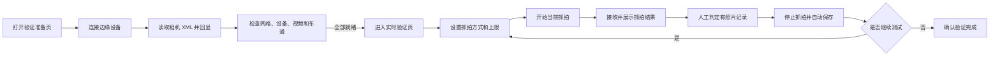
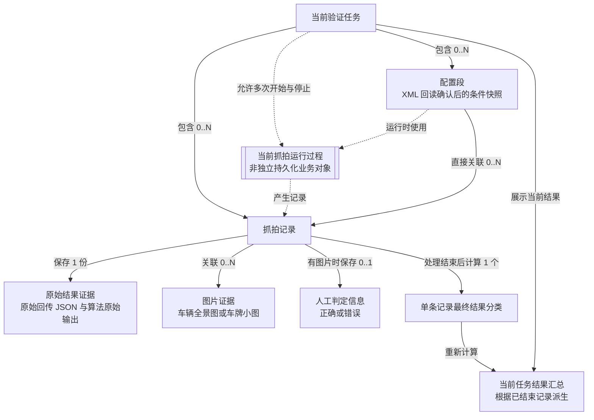
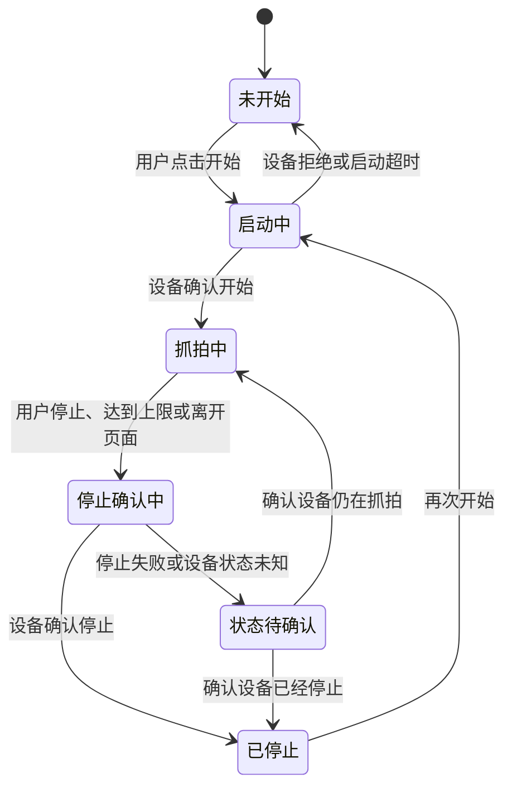
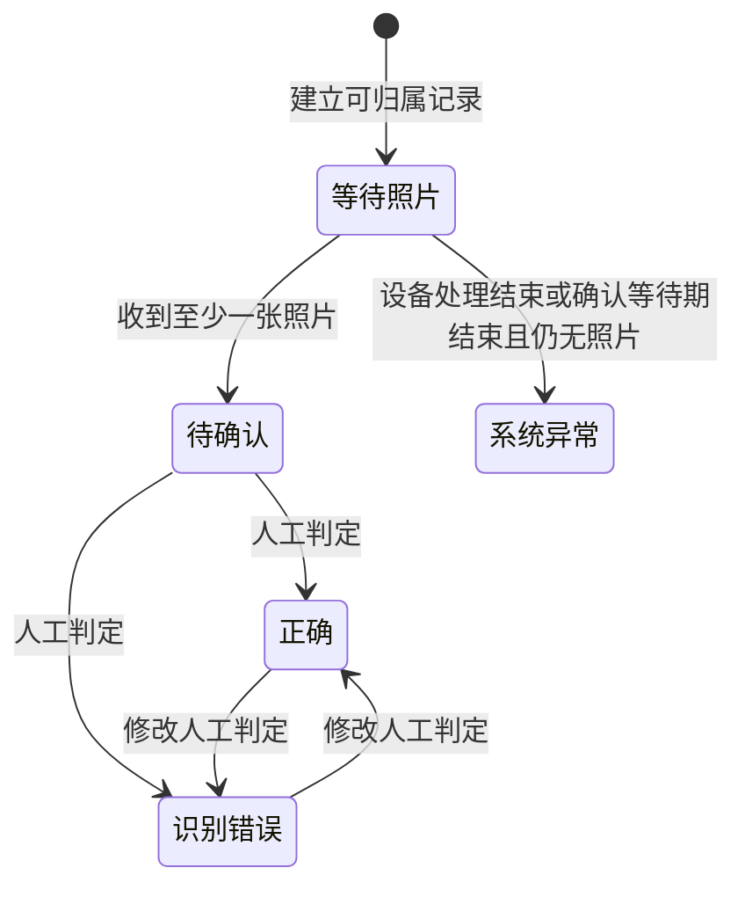

# 车牌识别算法部署验证工具 PRD

## 1、项目背景

### 1.1 业务现状

本需求来源于实验室老师提出的车牌识别算法部署验证需求，以及过去在真实车道环境中参与算法部署、设备配置和抓拍测试的经历。

离线评测只能说明算法对既有样本的处理情况。算法部署到边缘设备后，还需要在真实网络、视频源、车道和车辆触发条件下验证完整链路：设备能否抓拍、算法能否处理、图片和结果能否回传、验证人员能否根据照片核对结果。

现有工作通常分散在设备工具、命令或脚本、视频页面、图片文件夹和人工表格中。出现无画面、未抓拍、无照片或识别错误时，结果与产生条件容易分离，后续复核依赖个人经验。

**事实边界：** 集中测试阶段曾观察到约每周 2 次、每次约 3 小时的验证工作，但尚无稳定样本、分阶段耗时或错误率数据。

### 1.2 面临问题

| 优先级 | 问题 | 直接影响 |
| --- | --- | --- |
| P0 | 网络、设备、视频、车道和算法准备分散，开始条件依赖个人经验 | 容易遗漏前置条件，将准备问题误判为抓拍或算法问题 |
| P0 | 图片和识别结果没有稳定关联实际设备、算法、视频、车道和抓拍配置 | 不同条件下的样本混用，结果无法复核 |
| P0 | 算法输出容易被当成正确结论 | 误识别或算法失败无法通过人工核对明确归类 |
| P0 | 单条记录、异常事实、人工判定和汇总口径不统一 | 当前任务是否处理完成不清楚，统计可能重复或遗漏 |
| P1 | 异常提示只说明失败，没有指出阶段、数据是否保留和下一步 | 用户反复尝试或错误修改配置，排查成本增加 |

### 1.3 解决思路

| 设计方向 | 产品处理 | 解决的问题 |
| --- | --- | --- |
| 标准化任务流程 | 用一个当前验证任务串联准备、抓拍、确认和保存 | 操作分散、步骤遗漏 |
| 统一就绪判断 | 在进入实时验证前检查本机网络、边缘设备、视频源和验证车道 | 无法判断是否具备抓拍条件 |
| 记录条件关联 | 每条记录关联配置段、原始结果、图片和抓拍时间 | 结果脱离产生条件 |
| 人工结论独立 | 保留算法原始输出，由用户对有照片记录判定正确或错误 | 算法输出与人工结论混淆 |
| 汇总与自动保存 | 统计当前任务已经结束的结果并保存可恢复快照 | 任务无法收尾、结果难以复核 |

### 1.4 决策依据

| 类型 | 已知内容 | 本 PRD 的处理 |
| --- | --- | --- |
| 已确认业务事实 | 部署验证涉及 PC、边缘设备、RTSP 视频源、算法、车道、触发和多条抓拍结果 | 产品以验证任务组织完整链路，不以单个接口或单张图片为中心 |
| 已确认业务事实 | 有照片才能进行人工核对；算法返回结果不等于识别正确 | 原始算法结果与人工判定分开保存 |
| 已确认业务事实 | 同一轮验证中可以停止、调整条件后再次抓拍 | 同一个当前验证任务允许包含多次抓拍和多个配置段 |
| 产品决策 | 需要避免抓拍中途改变结果条件 | 抓拍中锁定全部影响结果的配置，停止后才允许修改 |
| 未验证假设 | 目标设备能够支持 XML 读取、写回、回读、抓拍控制和稳定结果归属 | 作为 P0 接口准入条件，真实联调前不认定已实现 |

## 2、需求基本情况

| 要素 | 内容 |
| --- | --- |
| 需求提出人 | 实验室老师 |
| 核心使用人 | 部署验证人员 |
| 协作使用人 | 算法开发人员、项目负责人 |
| 典型环境 | 指定 PC、目标边缘设备、相机或 RTSP 视频源、真实或可控车辆触发条件 |
| 核心痛点 | 准备条件、抓拍过程、图片结果和人工结论分散，难以形成可复核闭环 |
| 需求价值 | 让一次部署验证的条件、过程、结果和异常清楚可见并可保存 |

### 2.1 核心场景一：验证准备

| 场景要素 | 内容 |
| --- | --- |
| 使用角色 | 部署验证人员 |
| 触发条件 | 准备开始一次算法部署验证，已明确目标设备、视频源和车道 |
| 用户目标 | 完成本机网络、设备、视频、车道和算法沿用或更新准备 |
| 主流程摘要 | 选择本机网络并连接设备，读取当前配置，按需更新算法，检查 RTSP 画面，保存验证车道 |
| 完成结果 | 四项必要条件就绪后可以进入实时验证 |
| 异常入口 | 未连接、视频不可用、车道未确认或配置未生效时阻止进入，并指出未完成项 |

### 2.2 核心场景二：实时验证

| 场景要素 | 内容 |
| --- | --- |
| 使用角色 | 部署验证人员 |
| 触发条件 | 已完成验证准备并进入实时验证页面 |
| 用户目标 | 配置触发方式和抓拍上限，控制开始、停止或自动停止，观察结果回传 |
| 主流程摘要 | 核对抓拍配置，开始抓拍，查看当前状态、记录和图片，必要时停止后修改配置并再次开始 |
| 完成结果 | 当前抓拍停止；新增记录仍保留在同一当前验证任务中 |
| 异常入口 | 启停状态不明确、配置无效、无照片、无法归属或重复结果按第 10 章处理 |

### 2.3 核心场景三：结果确认

| 场景要素 | 内容 |
| --- | --- |
| 使用角色 | 部署验证人员；算法开发人员和项目负责人按授权查看结果 |
| 触发条件 | 当前任务已经产生抓拍记录 |
| 用户目标 | 对照图片和算法原始输出完成正确或错误判定，获得可复核结果 |
| 主流程摘要 | 选择记录，查看车牌小图和车牌号，必要时查看车辆全景图，进行人工判定并查看汇总 |
| 完成结果 | 当前抓拍已停止、等待照片和待确认记录均为 0 且自动保存成功时显示“验证完成” |
| 异常入口 | 无照片记录按系统异常处理；保存失败时保留内存状态并允许重试保存 |

### 2.4 需求价值拆解

| 需求 | 直接产出 | 价值 |
| --- | --- | --- |
| 验证准备 | 就绪状态和缺失项 | 减少准备遗漏 |
| 抓拍执行 | 清楚的配置、状态和当前计数 | 避免条件混用 |
| 结果确认 | 图片、算法结果和人工判定关联 | 避免误读算法输出 |
| 汇总保存 | 当前任务的分类汇总和可恢复快照 | 支持收尾与复核 |

## 3、产品定位与适用边界

### 3.1 产品定位

本产品是一款运行在 PC 端、面向车牌识别算法部署验证人员的专业工具。它用于验证算法部署到边缘设备后，能否在真实视频、车道和触发条件下完成抓拍、识别、结果回传和人工核对。

它不是算法训练平台、离线模型评测平台、通用设备运维平台，也不负责收费站运营、通行控制、计费结算或正式算法验收结论。

### 3.2 适用组织与角色

| 对象 | 与产品的关系 | 当前依据 |
| --- | --- | --- |
| 实验室及车牌识别算法研发团队 | 首期主要使用组织 | 来自本项目真实部署验证经历 |
| 部署验证人员 | 直接使用者 | 完成准备、抓拍、确认和清空当前任务 |
| 算法开发人员 | 异常样本协作复核者 | 按授权查看图片、原始输出和验证条件 |
| 项目负责人 | 结果与真实数据使用责任角色 | 确认任务结果、访问范围和清理要求 |
| 智能交通交付团队或设备厂商 | 潜在扩展对象 | 尚无充分访谈和采用证据 |

### 3.3 现有替代方式与同类工具

当前只完成了替代方式分析，尚未完成外部同类产品的系统调研，因此不虚构具体竞品、市场份额或采购意愿。

| 替代方式 | 可完成工作 | 主要不足 |
| --- | --- | --- |
| 命令、脚本和设备原始接口 | 连接设备、上传文件、修改参数、查看返回 | 操作分散，依赖技术经验，缺少任务级结果 |
| 厂商 Demo 或项目调试工具 | 配置设备、查看视频、调试特定接口 | 通常不覆盖人工确认、唯一汇总和结果上下文 |
| 图片文件夹、截图和表格 | 人工整理图片与错误样本 | 图片、算法结果和验证条件容易分离 |
| 通用设备或视频平台 | 管理设备、查看视频、展示识别结果 | 面向运营或设备管理，不以算法部署验证为核心 |

### 3.4 产品差异化

产品的差异不在于替代所有设备工具，而在于把“验证准备—抓拍执行—人工确认—结果汇总”组织为一个连续、可复核的验证任务，并明确区分算法输出、异常事实和人工结论。

### 3.5 待验证的产品化假设

| 假设 | 验证方式 | 当前状态 |
| --- | --- | --- |
| 统一流程能够减少准备遗漏和条件混用 | 原型测试后再通过真实 MVP 对比无效启动和操作错误 | 待验证 |
| 任务级记录能降低异常复核成本 | 让部署验证人员和算法人员使用真实记录复核 | 待验证 |
| 该工具适用于实验室以外的项目交付团队 | 访谈和真实场景试用 | 待验证 |

## 4、项目收益目标

### 4.1 项目目标

| 目标 | 首期要求 | 验证方式 |
| --- | --- | --- |
| 核心闭环 | 完成准备、抓拍、确认和自动保存 | 第 4.2.1 P0 用例 |
| 流程规范 | 四项就绪、启停状态和配置锁定按规则工作 | 准备、配置和抓拍用例 |
| 结果可复核 | 记录关联实际条件、原始结果、图片和人工判定 | 结果、汇总和恢复用例 |
| 使用效率 | 减少分散操作、重复确认和人工整理投入 | 首轮试用建立基线后评估，不预设提升比例 |

### 4.2 首期真实 MVP 交付验收标准

真实 MVP 必须在真实 PC、目标边缘设备、视频源和车辆触发条件下验收。接口准入能力未确认时，不得使用原型或模拟结果替代。

| 维度 | 通过标准 |
| --- | --- |
| 核心闭环 | 用户能够完成准备、抓拍、确认和自动保存 |
| 配置与抓拍 | XML 回读确认、配置锁定、开始、停止和上限自动停止符合规则 |
| 结果与判定 | 记录归属、图片、算法原始结果、人工判定和唯一分类一致 |
| 保存与清理 | 能自动保存、恢复同一当前任务并二次确认清空 |
| 异常与安全 | 异常说明状态和下一步；数据与凭据不被不当暴露 |
| 交付质量 | 15 条 P0 用例全部通过，且不存在阻断核心闭环的缺陷 |

### 4.2.1 首期真实 MVP 可执行交付验收用例

验收记录必须填写实际结果、证据位置和缺陷编号。设备凭据、RTSP 密码和真实车辆数据须脱敏。

| 用例 | 验收目标 | 前置条件与操作 | 通过条件 | 证据 | 规则依据 |
| --- | --- | --- | --- | --- | --- |
| ACC-PREP-01 | 未就绪时阻止进入实时验证 | 分别保留一项必要条件未完成并尝试进入 | 指出全部未完成项，不创建抓拍记录 | 页面状态与提示 | PREP-R1、R10—R11 |
| ACC-PREP-02 | 四项就绪后可进入 | 完成网络预检、设备连接、有效视频和合法车道 | 进入实时验证且无阻断提示 | 就绪状态与设备证据 | PREP-R1、R10—R11 |
| ACC-CONFIG-01 | 读取并回显相机 XML | 连接设备并从待联调确认的目标路径读取 XML | 页面值与回读内容一致；PC IP 不写入 XML | 脱敏 XML 与页面截图 | PREP-R2—R3 |
| ACC-CONFIG-02 | 写回后回读确认才生效 | 停止抓拍，修改一个已定版字段并保存 | 语义等价才显示生效并创建配置段 | 提交值、回读 XML、配置段 | PREP-R4—R6、R12 |
| ACC-CONFIG-03 | 抓拍中锁定配置 | 开始抓拍后尝试修改全部结果相关配置 | 全部入口不可修改；停止后恢复 | 抓拍中/停止后截图 | CAPTURE-R8—R10 |
| ACC-CAPTURE-01 | 正确处理开始、停止和关闭页面 | 开始、主动停止；再次开始后关闭实时页 | 状态以设备确认为准；关闭前先停止；任务不结束 | 状态响应与页面变化 | CAPTURE-R1—R2、R6、R10 |
| ACC-CAPTURE-02 | 上限和再次抓拍计数正确 | 设置合法上限并触发到上限，再次开始 | 到上限自动停止；再次开始从 0 计数；旧记录保留 | 设备触发数与记录 | CAPTURE-R4—R7、R11 |
| ACC-RESULT-01 | 正常回传形成可确认记录 | 产生一次带稳定记录唯一信息和照片的可归属回传 | 记录关联任务、配置段、图片和原始结果，默认待确认 | JSON、图片、记录详情 | RECORD-R1、R4—R5 |
| ACC-RESULT-02 | 意外重复回传不重复计数 | 再次投递具有相同设备归属、任务归属和记录唯一信息的结果 | 不新增记录、不重复统计，保留重复事实 | 两次回传和计数对比 | RECORD-R6 |
| ACC-RESULT-03 | 无照片异常不停止抓拍 | 产生无照片记录并等到处理结束 | 归为系统异常、不可人工判定，后续抓拍继续 | 状态时间线和后续记录 | RECORD-R3、SUMMARY-R4A |
| ACC-REVIEW-01 | 人工判定与算法事实分离 | 对正常结果和“算法失败但有照片”结果判定 | 有照片只可判正确或错误，不提供第三种人工结论 | 详情、操作和汇总 | REVIEW-R1—R5 |
| ACC-SUMMARY-01 | 汇总和完成结论正确 | 形成等待照片、待确认和三类最终结果，完成处理并停止抓拍 | 等待照片和待确认不设置为结果统计项；已完成总计等于正确、识别错误和系统异常之和；不存在处理中记录且保存成功后才显示验证完成 | 记录状态、结果汇总、保存状态 | SUMMARY-R1—R8 |
| ACC-SAVE-01 | 自动保存与恢复正确 | 保存后异常退出并重新打开 | 恢复同一当前任务最近成功快照 | 本地数据和页面 | SUMMARY-R8—R9 |
| ACC-CLEAR-01 | 清空边界正确 | 先取消清空，再确认清空 | 取消不变；确认后清空整个当前任务；不提供逐条移除 | 清空前后数据和弹窗 | TASK-R6—R9、SUMMARY-R10 |
| ACC-SECURITY-01 | 敏感信息不泄露 | 使用受控测试凭据后检查页面、日志和存储 | 不出现明文密码、令牌或完整凭据 | 脱敏检查记录 | 第 12.3 节 |

### 4.3 首期真实 MVP 试用成功标准

| 指标 | 口径 | 目标 |
| --- | --- | --- |
| 端到端任务完成率 | 独立完成准备、抓拍、确认和保存的人数 ÷ 参与人数 | `[TODO：首轮试用建立基线后确定]` |
| 平均任务完成时间 | 从开始准备到首次满足验证完成的平均时间 | `[TODO：首轮试用建立基线]` |
| 平均操作错误数 | 每名用户的无效输入、错误顺序和状态误解数量 | `[TODO：首轮试用建立基线]` |
| 关键规则理解率 | 能正确说明就绪、抓拍、人工判定、系统异常和验证完成的用户比例 | `[TODO：首轮试用后确定]` |

### 4.4 后续真实试用的收益评估口径

收益采用同口径的“原工作方式基线—产品试用期”对比，不将过去观察性估计直接作为目标值。

- 单轮节省工时 = 原流程单轮平均参与工时 − 试用期单轮平均参与工时。
- 任务耗时改善率 =（基线平均耗时 − 试用期平均耗时）÷ 基线平均耗时。
- 无效启动下降率 =（基线无效启动次数 − 试用期无效启动次数）÷ 基线无效启动次数。
- 结果信息完整率 = 满足条件、图片/异常事实、判定和保存要求的记录数 ÷ 应保存记录数。

### 4.5 当前不作为收益目标的内容

“验证完成”只说明当前任务记录已按规则完成确认和保存，不表示算法准确率达标、正式验收通过或产品已经产生商业收益。首期不承诺外部客户数、市场份额、收入或模型效果提升。

## 5、项目方案概述

### 5.1 核心功能概述

| 模块 | 功能 | 优先级 |
| --- | --- | --- |
| 验证任务与上下文 | 组织设备、算法、视频、车道、配置段和全部记录 | P0 |
| 验证准备与就绪检查 | 完成本机网络、设备、视频、车道及算法准备 | P0 |
| 抓拍配置与任务执行 | 配置触发方式和上限，控制开始、停止和自动停止 | P0 |
| 抓拍结果接收与查看 | 保存、展示和去重抓拍结果及图片 | P0 |
| 人工结果确认 | 对有照片记录判定正确或错误 | P0 |
| 汇总与自动保存 | 统计三类最终结果、保存和恢复当前任务 | P0 |
| 异常反馈 | 说明异常阶段、当前状态、数据保留和下一步 | P0 |

### 5.2 整体方案概述

#### 5.2.1 产品方案

产品采用两个主要工作区：验证准备页负责确认开始抓拍所需条件；实时验证页负责抓拍配置、执行、结果查看、人工判定和汇总。用户不需要填写任务名称或任务 ID，系统自动维护一个当前验证任务。

#### 5.2.2 核心业务流程

| 阶段 | 用户动作 | 系统结果 |
| --- | --- | --- |
| 验证准备 | 完成网络、设备、视频和车道检查 | 四项就绪后允许进入实时验证 |
| 抓拍设置 | 选择触发方式、线圈和本次上限 | 保存本次抓拍条件 |
| 抓拍执行 | 开始、观察结果并按需停止 | 设备确认状态，记录持续归入当前任务 |
| 人工确认 | 对有照片记录判断正确或错误 | 结束该记录的处理过程并更新最终结果汇总 |
| 保存或继续 | 查看保存结果，决定是否再次抓拍 | 保留当前任务；再次抓拍时只重置本次计数 |

#### 5.2.3 关键策略及制定原因

| 策略 | 规则 | 制定原因 | 对产品的影响 |
| --- | --- | --- | --- |
| 当前任务 | 同一当前任务允许多次开始和停止抓拍 | 停止、调整条件后继续测试仍属于同一轮持续验证 | 再次开始时当前计数归零，已有记录继续保留 |
| 配置锁定 | 抓拍中禁止修改所有影响结果的配置 | 避免一条记录无法确认在什么条件下产生 | 配置入口置灰，停止后才恢复 |
| XML 生效 | 上传配置后必须重新从相机读取；目标字段语义等价才生效 | PC 页面保存不能证明相机已经采用配置 | 回读失败或不一致时不创建新配置段 |
| 配置冲突 | 首期不使用配置版本号，也不建设 PC 端冲突管理 | 单机验证场景下，相机回读内容才是最终事实 | 保存配置段及回读时间，不维护版本竞争 |
| 结果回传 | 每条业务结果按一次性回传处理，不增加业务层结果补偿机制 | 工具需要暴露真实链路问题，避免补偿机制掩盖失败 | 意外重复结果只做幂等去重 |
| 串行处理 | 同一时刻只存在一条正在等待照片和结果的记录 | 设备当前按单条记录处理，前一条未结束时不会处理下一条 | 页面不得同时出现多条等待照片记录 |
| 系统异常 | 已归属记录处理结束且仍无任何照片时，唯一归为系统异常 | 无照片无法进行人工核对；有照片则仍可判断算法结果 | 系统异常不进入人工判定，也不停止后续抓拍 |
| 人工判定 | 有照片记录只允许判定正确或错误 | “待确认”是处理过程，不是最终结果；额外人工分类会破坏统一结果口径 | 人工判定与算法原始结果分开保存 |
| 清理边界 | 记录形成后不可逐条移除，只能二次确认清空整个当前任务 | 局部移除会破坏任务记录完整性和汇总可追溯性 | 首期不建设历史任务中心或回收站 |

#### 5.2.4 异常处理原则

- 系统只表达输入校验、设备响应、视频状态和回传数据能够证明的事实，不自动判断最终根因。
- 影响安全继续的异常要阻断下游操作，并给出修改、查询、重试当前控制操作或返回准备页等入口。
- 单个字段或图片异常不应静默删除整条已归属记录。
- 设备状态不明确时显示“设备状态待确认”，不得把按钮点击当成设备执行成功。
- 设备结果按一次性发送处理；本地自动保存失败可以再次保存，两者必须区分。

#### 5.2.5 接口准入条件与联调边界

真实 MVP 开发和 P0 验收前，目标设备至少需要确认以下能力：

1. 读取、上传并回读相机 XML，且能够定义字段映射和语义等价规则；
2. 支持抓拍开始、停止、状态查询和设备触发数；
3. 每条结果提供稳定的设备归属、当前验证任务归属和记录唯一信息，并包含结果时间、照片信息和算法原始输出；具体字段名称、格式和生成方待联调确认；
4. 无照片记录能够提供处理结束或解除串行占用的可确认信号；
5. 能够配置或验证 PC 本地回传地址，并限制结果来源；
6. 明确接口认证、错误码、超时、请求幂等和支持的设备版本。

具体通信协议、端口、路径、字段、认证方式、超时和错误码以目标设备联调定版结果为准，统一记录在《接口联调说明_v0.md》中；联调完成前，不作为已确认接口或交付事实。

### 5.3 首期 MVP 范围

#### 5.3.1 MVP 范围原则

P0 只包含缺失后会阻断“准备—抓拍—确认—保存”闭环的能力。提升效率、跨任务管理和商业化能力不因有价值而自动进入 P0。

#### 5.3.2 P0 能力边界

| P0 能力 | 最低完成要求 |
| --- | --- |
| 当前任务 | 系统自动维护一个当前任务，允许多次抓拍和多个配置段 |
| 准备 | 四项就绪判断、算法沿用或更新、XML 读取、RTSP 检查和车道确认 |
| 抓拍 | 虚拟/地感触发、线圈配置、1—100 上限、开始、停止和状态确认 |
| 结果 | 记录归属、图片、算法输出、原始 JSON、异常事实和去重 |
| 确认 | 正确/错误人工判定、系统异常归类和唯一汇总 |
| 保存 | 本地自动保存、最近快照恢复和二次确认清空当前任务 |
| 安全 | 凭据保护、本地数据访问限制和日志脱敏 |

#### 5.3.3 P1：有价值但不属于最低闭环

- 更高效的记录筛选、快捷操作和批量查看；
- 更完整的诊断信息与设备日志关联；
- 正式报告导出；
- 更丰富的原型可用性优化。

#### 5.3.4 P2：未来产品机会

- 历史任务中心、跨任务搜索和条件对比；
- 多设备、多项目和多人协作；
- 角色管理、操作审计和跨设备同步；
- 面向其他算法团队、项目交付团队或设备厂商的产品化适配。

#### 5.3.5 核心验证假设

| 假设 | 首期验证方式 |
| --- | --- |
| 两个工作区能够覆盖完整验证闭环 | 原型测试与 P0 端到端用例 |
| XML 回读可以形成可信配置段 | 真实设备配置联调 |
| 设备结果能够稳定归属和去重 | 真实回传样例与异常用例 |
| 任务级汇总比文件夹和表格更易复核 | 部署验证人员真实试用 |

## 6、项目范围

### 6.1 项目范围说明

首期建设单机 PC 验证工具，覆盖当前任务的准备、抓拍、结果确认、自动保存和清空，不扩展为算法训练、正式评测、设备运营或多用户平台。

### 6.2 涉及系统与业务对象

| 对象 | 关系 | 本项目需要的能力 | 责任方 |
| --- | --- | --- | --- |
| PC 客户端 | 主体产品 | 页面、任务、设备交互、回传接收和本地保存 | 客户端研发 |
| 边缘设备 | 外部执行端 | 算法加载、抓拍控制、状态和结果输出 | 设备端负责人 |
| 相机/RTSP 视频源 | 视频与配置来源 | XML 配置、有效视频和图像 | 视频/设备负责人 |
| 虚拟或地感线圈 | 触发来源 | 四点区域或硬件触发事件 | 设备/现场负责人 |
| 车牌识别算法 | 被验证对象 | 可部署文件、运行标识和算法结果 | 算法人员 |
| 本地存储 | 数据承载 | 结构化业务数据、图片目录、快照恢复和清空；具体存储技术待客户端方案确认 | 客户端研发 |

#### 6.2.1 业务接口边界与接口确认

PC 客户端负责输入校验、页面状态、任务关联、结果保存和人工判定。设备端负责实际配置、算法加载、触发、抓拍、运行状态和结果输出。具体协议、接口参数和成功证据以[《接口联调说明》](接口联调说明.md)中的联调定版结论为准；原型只表达交互，不承担真实接口验证。

### 6.3 影响范围

| 范围 | 主要影响 |
| --- | --- |
| 用户 | 部署验证人员从分散工具转为两个工作区的连续流程；算法人员按授权查看异常样本 |
| 流程 | 开始抓拍前增加统一就绪检查；结果必须经过人工确认和自动保存 |
| 数据 | 新增当前任务、配置段、记录、原始结果、处理事实、判定、分类和恢复快照 |
| 上下游 | 依赖设备、相机、RTSP、算法文件、触发接口和本地回传服务 |
| 环境 | 首期目标为受控 Windows 11 24H2 64 位 PC 和局域网设备 |

### 6.4 责任边界与外部依赖

#### 6.4.1 责任边界

| 工作 | 产品/客户端责任 | 外部支持 |
| --- | --- | --- |
| 需求与交互 | 定义流程、状态、规则、原型和验收 | 目标用户评审与测试 |
| 设备连接和配置 | 展示状态，读取/修改/回读配置 | 设备端提供稳定接口与错误信息 |
| 算法更新 | 校验文件并展示最终结果 | 算法人员提供合法文件，设备端完成加载 |
| 视频与触发 | 展示画面、配置和状态 | 相机、视频源和触发设备可用 |
| 结果与保存 | 接收、归属、展示、判定、汇总和本地保存 | 设备端提供稳定记录标识和结果字段 |
| 真实数据 | 按授权范围保存和展示 | 项目负责人确认授权、访问和清理要求 |

#### 6.4.2 关键外部依赖

- 目标设备、软件版本和接口责任方明确；
- 实验室能够提供 PC、边缘设备、视频源、车道和车辆触发条件；
- XML、RTSP、抓拍控制、结果回传和算法加载接口可联调；
- Windows 本地目录、凭据保护和防火墙规则可配置；
- 使用真实车辆图片和车牌号前完成内部授权。

### 6.5 不在本项目范围内

- 算法训练、模型调优、训练数据管理和正式准确率评测；
- 摄像头、边缘设备、地感线圈和网络硬件采购或现场建设；
- 收费、通行、停车场或收费站日常运营；
- 历史任务中心、跨任务对比、单条记录删除和复杂权限；
- 自动判断网络、设备、视频、触发或算法异常的最终根因；
- 对外商业化、计费、合同和客户管理。

### 6.6 项目交付物

#### 6.6.1 产品设计阶段交付物

| 交付物 | 状态 |
| --- | --- |
| PRD V2 评审版 | 本文档，待人工评审 |
| 验证准备和实时验证高保真 Web Demo | 已有主要流程，仍为模拟原型 |
| [接口联调说明](接口联调说明.md) | v0.2 联调设计稿已更新，尚未执行目标设备真实联调 |
| 原型截图和评审记录 | 已补充原型截图 |

#### 6.6.2 首期真实产品研发交付物

| 交付物 | 验收要求 |
| --- | --- |
| Windows PC 客户端 | 核心流程、规则、状态和异常符合第 10 章 |
| 已定版接口说明 | 与真实设备、XML、RTSP、抓拍和回传联调结果一致 |
| 本地数据能力 | 数据可创建、更新、读取、恢复和完整清空 |
| 安装与操作说明 | 目标人员可按说明部署并完成核心任务 |
| 测试与验收记录 | 15 条 P0 用例全部通过，无阻断缺陷 |

## 7、项目风险

### 7.1 前提假设

| 编号 | 假设 | 不成立的影响 |
| --- | --- | --- |
| A1 | 目标设备支持配置、抓拍控制、状态查询和结果回传 | 真实 MVP 无法形成闭环，需改造设备端或缩小范围 |
| A2 | 设备能够提供稳定记录标识和处理结束信号 | 记录无法可靠归属、去重或结束无照片等待 |
| A3 | 实验室能够提供真实联调环境和触发条件 | 只能验证原型，不能完成真实交付验收 |
| A4 | 部署验证人员可以完成人工正确/错误判定 | 待确认记录无法收尾 |

### 7.2 约束条件

| 编号 | 约束 | 对设计的影响 |
| --- | --- | --- |
| C1 | 首期只适配明确的设备型号、软件版本和接口 | 不承诺通用设备兼容性 |
| C2 | 首期在单台受控 Windows PC 本地运行和保存 | 必须处理目录权限、磁盘、恢复和清空 |
| C3 | 首期不建设登录、RBAC、多租户和跨设备同步 | 访问控制依赖 Windows 账号和内部授权 |
| C4 | 原型不能证明真实接口能力 | 所有 P0 外部能力必须真实联调 |
| C5 | 缺少完整设备日志和错误码 | 只能反馈可证明事实，不能自动断言根因 |

### 7.3 风险清单

| 编号 | 风险 | 概率 | 影响 | 应对 |
| --- | --- | --- | --- | --- |
| R1 | PRD 假设与目标设备实际接口不一致 | 高 | 高 | 先打通最小链路，记录差异后更新接口与用例 |
| R2 | 不同设备或算法版本支持能力不同 | 中 | 高 | 锁定首期型号和版本，建立回归范围 |
| R3 | 回传字段、标识或图片不完整导致记录不可信 | 中 | 高 | 定版最小字段，保存原始结果并执行缺失/重复用例 |
| R4 | 设备、场地和车辆可用时间不足 | 中 | 高 | 提前锁定联调窗口，优先测试不可模拟场景 |
| R5 | P0 同时覆盖多个外部接口导致延期 | 高 | 高 | 按最小链路推进，新增 P0 必须评估依赖和排期 |
| R6 | 真实车辆图片、车牌号或凭据使用不当 | 中 | 高 | 明确授权、限制访问、日志脱敏并提供完整清空 |
| R7 | 页面状态和记录操作过多导致用户继续使用旧方式 | 中 | 中 | 通过原型测试记录卡点，优先减少无效步骤 |

## 8、术语

| 术语 | 简要定义 | 详细规则 |
| --- | --- | --- |
| 验证任务 | 组织一次连续部署验证的业务单位 | TASK-R1—R10 |
| 当前抓拍 | 当前任务中的一次连续开始到停止运行过程；首期不要求作为独立持久化业务对象 | CAPTURE-R6—R13 |
| 验证上下文 | 用于结果归属和复核的已确认条件集合 | TASK-R3—R8 |
| 配置段 | 相机 XML 回读确认后形成的不可变条件记录 | TASK-R3—R5、PREP-R12 |
| 抓拍记录 | 具备稳定记录唯一信息且可归属当前任务的有效记录 | RECORD-R1—R7B |
| 异常回传 | 缺少归属条件或稳定记录标识，仅供排查的回传 | RECORD-R1A、R6 |
| 人工判定 | 用户对有照片记录作出的正确或错误结论 | REVIEW-R1—R5 |
| 处理中记录 | 处于等待照片或待确认状态、尚未形成最终结果的记录 | SUMMARY-R3 |
| 最终结果分类 | 已结束记录归入正确、识别错误或系统异常中的唯一一类 | SUMMARY-R1—R4A |
| 已完成总计 | 正确、识别错误和系统异常三类最终结果数量之和 | SUMMARY-R2 |
| 系统异常 | 已归属记录处理结束时仍无任何照片 | RECORD-R3、SUMMARY-R4A |
| 抓拍上限 | 一次当前抓拍允许的设备有效触发数，范围 1—100 | CAPTURE-R4 |
| 验证完成 | 当前记录满足确认、停止和保存条件后的页面结论 | SUMMARY-R5—R7 |

## 9、参考文献

### 9.1 外部参考资料

| 资料 | 用途 |
| --- | --- |
| Silva & Jung, *License Plate Detection and Recognition in Unconstrained Scenarios*, ECCV 2018 | 说明真实采集条件对车牌识别的影响 |
| Shi et al., *Edge Computing: Vision and Challenges*, IEEE IoT Journal 2016 | 说明边缘设备、网络和数据源协同背景 |
| RFC 7826, Real-Time Streaming Protocol Version 2.0 | RTSP 术语参考 |
| RFC 4251, The Secure Shell Protocol Architecture | SSH 连接与安全术语参考 |
| 《中华人民共和国个人信息保护法》、GB/T 35273—2020 | 车辆图片、车牌号和现场信息保护参考 |

### 9.2 内部引用文档

| 文档                     | 状态/位置                   | 作用                                  |
| ---------------------- | ----------------------- | ----------------------------------- |
| [接口联调说明](接口联调说明.md) | v0.2 联调设计稿，尚未执行目标设备真实联调 | 记录已确认的接口相关产品规则、待确认接口事项、联调检查项和后续定版结论 |
| 目标边缘盒接口说明              | `[TODO：补充版本]`           | 定版连接、配置、抓拍和回传接口                     |
| 视频参数与算法加载说明            | `[TODO：补充版本]`           | 定版 RTSP 能力和算法部署流程                   |

## 10、功能需求

### 10.1 产品功能总体设计

#### 10.1.1 产品功能概述

真实 MVP 由验证准备页和实时验证页组成。准备页负责连接设备、读取并确认配置、检查视频与车道条件；实时验证页负责开始和停止抓拍、接收结果、人工判定、汇总与保存。

#### 10.1.2 核心业务数据关系

本图根据第 5.2.3 节的关键策略和第 10.2 节的业务规则整理，用于说明产品中的信息归属与复核关系。具体存储结构由客户端技术设计和目标设备接口联调后确定。

| 对象/信息组 | 作用 | 关键边界与实现状态 |
| --- | --- | --- |
| 验证任务 | 承载当前一次部署验证的全部上下文和正式记录 | 首期只维护一个当前任务，是已确认的产品对象 |
| 配置段 | 保存一次 XML 回读确认后的条件快照 | 形成后不可覆盖；每条后续记录直接关联其实际使用的配置段 |
| 当前抓拍运行过程 | 表示一次开始到停止的连续运行过程 | 同一任务可经历多次；每次独立计算上限，但首期不要求将其设计为独立持久化实体 |
| 抓拍记录 | 保存一条可归属结果及其实际产生条件 | 直接属于当前任务并关联配置段；形成后不允许单条删除 |
| 原始结果证据 | 保留设备原始回传 JSON 和算法原始输出 | 不被人工判定覆盖；字段结构以设备联调为准 |
| 图片证据 | 保存车辆全景图和车牌小图的关联信息 | 一条记录可以没有图片、只有一种图片或同时具有两种图片；实际目录和引用方式待技术设计 |
| 人工判定信息 | 保存有照片记录的正确或错误结论 | 是产品逻辑信息；可以实现为记录字段或独立结构，首期不要求保存完整修改历史 |
| 单条记录最终结果分类 | 表示处理结束后的正确、识别错误或系统异常中的唯一一类 | 等待照片和待人工确认期间没有最终结果分类；最终分类根据图片、处理事实和人工判定计算，不与算法原始结果混为一类 |
| 当前任务汇总 | 展示当前任务已经结束的三类结果数量 | 是根据具有最终结果分类的记录重新计算的派生结果；等待照片和待人工确认只在记录详情或列表中显示状态，不设置为结果统计项 |

#### 10.1.3 当前抓拍与单条记录状态

当前抓拍和单条记录是两个不同对象，分别使用独立状态机。单条记录状态变化不会改变当前抓拍状态；出现系统异常时，当前抓拍仍可继续。

**当前抓拍状态**

**单条记录状态**

| 所属对象 | 状态 | 含义 | 允许的主要操作 | 是否进入最终结果统计 |
| --- | --- | --- | --- | --- |
| 当前抓拍 | 未开始/已停止 | 当前没有运行中的抓拍 | 修改配置、开始抓拍、查看记录、清空任务 | — |
| 当前抓拍 | 启动中/停止确认中/状态待确认 | 正在等待设备确认真实运行状态 | 查看状态；禁止重复启停和修改配置 | — |
| 当前抓拍 | 抓拍中 | 设备已确认开始，正在接收结果 | 停止抓拍、查看记录；影响结果的配置均锁定 | — |
| 单条记录 | 等待照片 | 已建立可归属记录，尚未收到任何照片 | 等待设备处理结束或确认等待期结束 | 否，属于处理中 |
| 单条记录 | 待确认 | 已有照片，等待人工判断 | 判定正确或错误、查看全景图 | 否，属于处理中 |
| 单条记录 | 正确/识别错误 | 已完成人工判定 | 查看或修正人工判定 | 是，二者互斥 |
| 单条记录 | 系统异常 | 处理结束时仍无任何照片 | 查看记录；不能人工判定，不停止当前抓拍 | 是 |

“验证完成”是当前任务的页面结论，不是当前抓拍或单条记录的状态。只有当前抓拍已停止、不存在等待照片或待确认记录、最近一次自动保存成功时，才显示“验证完成”。

#### 10.1.4 P0 功能清单

| 模块 | P0 功能 | 验收依据 |
| --- | --- | --- |
| 验证任务 | 建立、恢复和清空当前任务；保存验证上下文 | ACC-SAVE-01、ACC-CLEAR-01 |
| 验证准备 | 连接设备、读取 XML、视频预览、车道与就绪检查 | ACC-PREP-01—02、ACC-CONFIG-01—02 |
| 抓拍执行 | 设置触发方式、线圈和 1—100 上限；开始、停止与锁定配置 | ACC-CAPTURE-01—02 |
| 结果接收 | 归属结果、展示图片和状态、识别无照片系统异常 | ACC-RESULT-01—03 |
| 人工确认 | 对有照片记录判定正确或错误 | ACC-REVIEW-01 |
| 汇总保存 | 分类统计、自动保存、恢复和完整清空 | ACC-SUMMARY-01、ACC-SAVE-01、ACC-CLEAR-01 |

#### 10.1.5 原型页面索引

| 页面/弹窗 | 原型入口 | 主要职责 | 
| --- | --- | --- | 
| 验证准备页 | [plate-capture-system_main.html](原型界面/plate-capture-system_main.html) | 设备连接、配置、视频和就绪检查 | 
| 实时验证页 | [capture.html](原型界面/capture.html) | 抓拍、结果确认、汇总和清空 | 
| 绘制/显示线圈弹窗 | 由实时验证页打开 | 编辑并保存四点线圈，或只读查看已保存线圈 | 
| 车辆全景图弹窗 | 由实时验证页记录打开 | 查看、放大、缩小和复位车辆全景图 | 
| 清空确认弹窗 | 由实时验证页打开 | 二次确认清空当前任务全部数据 | 

原型仅表达页面和交互意图。设备连接、XML 上传与回读、RTSP、抓拍和结果回传仍须由真实 MVP 实现并联调。

### 10.2 核心功能需求

#### 10.2.1 验证任务与上下文

##### 10.2.1.1 业务流程

1. 用户首次进入准备页时，系统建立一个当前验证任务。
2. 用户完成设备、算法、视频、相机参数、车道和抓拍条件准备。
3. 配置通过相机回读确认后，系统建立配置段并用于后续记录归属。
4. 用户可在同一任务中停止后再次开始抓拍；记录继续累计。
5. 用户可在没有运行中抓拍时，二次确认后清空当前任务并建立新的空任务。

##### 10.2.1.2 页面交互

- 页面持续展示当前任务状态、创建时间、记录数和保存状态。
- 有可恢复快照时自动恢复到当前任务，不另建“历史任务”入口。
- 抓拍中不提供清空操作；停止后才可发起清空。
- 清空弹窗必须说明清空范围、记录数量和不可撤销结果。

##### 10.2.1.3 业务规则

| 编号 | 规则 | 原因与影响 |
| --- | --- | --- |
| TASK-R1 | 首期同时只存在一个当前验证任务。 | 避免引入历史任务、任务切换和权限管理。 |
| TASK-R2 | 关闭软件后通过本地快照恢复同一当前任务。 | “最近恢复快照”是恢复方式，不是第三种任务状态。 |
| TASK-R3 | 当前任务可包含多个配置段，并可经历多次抓拍运行过程；当前抓拍是一次开始到停止的运行过程，首期不要求作为独立持久化业务对象。 | 支持同一现场连续调整和重复测试，同时避免在 PRD 中提前限定数据库结构。 |
| TASK-R4 | 配置段在 XML 回读一致后形成，形成后不可覆盖；后续抓拍记录直接关联其实际使用的配置段。 | 保证每条结果可还原当时条件，不只通过运行过程间接推断。 |
| TASK-R5 | 配置变化只影响确认生效后的新记录。 | 已有记录保持原上下文。 |
| TASK-R6 | 抓拍记录形成后不可逐条移除。 | 防止汇总失真和证据链断裂。 |
| TASK-R7 | 仅允许二次确认后清空当前任务全部记录、配置段、汇总和本地快照。 | 操作边界明确，避免残留。 |
| TASK-R8 | 抓拍中禁止清空当前任务。 | 避免回传结果失去归属。 |
| TASK-R9 | 首期不提供任务历史、任务切换和按历史任务删除。 | 控制 MVP 范围。 |
| TASK-R10 | “验证完成”仅是当前结果完备状态，不会关闭或归档任务。 | 用户仍可在同一任务中继续抓拍。 |

#### 10.2.2 验证准备与就绪检查

##### 10.2.2.1 业务流程

1. 用户确认 PC 本机 IPv4，填写边缘盒 IP 并连接设备。
2. 连接成功后，系统从相机读取当前 XML 配置并回显。
3. 用户选择算法文件、填写或确认 RTSP 参数，并检查视频画面。
4. 用户设置车道和其他必要配置；如有修改，提交后等待上传与回读确认。
5. 本机网络、边缘盒、视频源和车道全部就绪后，用户进入实时验证页。

##### 10.2.2.2 页面交互

- 未连接设备时，设备配置和进入实时验证入口不可用。
- 连接、读取、上传和回读分别显示进行中、成功或失败反馈。
- 四项就绪条件逐项显示状态；条件不足时明确指出未完成项。
- Web Demo 中的“保存成功”仅模拟反馈，不代表真实相机 XML 已更新。

验证准备页

首次打开页面，不执行设备连接。

![[prototype-prep-disconnected.png]]

设备连接成功，相机当前参数已回显，视频尚未播放，此时用户尝试进入实时验证失败。

![[prototype-prep-connected-config-loaded.png]]

设备已连接，RTSP 画面正常播放，本机网络、边缘盒、视频源和车道均已就绪，“进入实时验证”可用。

![[prototype-prep-video-playing.png]]

修改视频参数、车道或其他相机配置后，页面显示提交和回读结果。

![[截屏2026-09-03 19.53.04.png]]
![[截屏2026-09-03 19.53.30.png]]
修改IP地址，输入合规的地址，提示成功修改。

![[截屏2026-09-03 19.53.58.png]]
输入不合规的地址时，提示错误。
![[截屏2026-09-03 19.55.20.png]]

##### 10.2.2.3 业务规则

| 编号 | 规则 | 原因与影响 |
| --- | --- | --- |
| PREP-R1 | 进入实时验证前，四项就绪条件必须全部通过。 | 防止在基础条件缺失时产生无效记录。 |
| PREP-R2 | 相机端 XML 是相机配置的事实来源；实际路径、传输方式、节点映射和可修改字段以接口联调定版结论为准。 | 已确认配置载体，但旧代码和原型不能证明目标设备的具体接口。 |
| PREP-R3 | 连接成功后必须读取相机当前 XML，PC 不以旧本地值替代设备当前值。 | 设备端是配置事实来源。 |
| PREP-R4 | 用户提交配置时，流程为读取 XML、本地修改目标字段、上传、重新回读并比较目标字段。 | 只有相机实际保存的值才能证明生效。 |
| PREP-R5 | 目标字段语义一致才显示配置生效；上传成功但回读不一致视为失败。 | 避免把传输成功误当配置生效。 |
| PREP-R6 | 比较时允许 XML 节点顺序、空白和格式差异；不可只比较文件字节。 | 降低格式化造成的误报。 |
| PREP-R7 | 不引入 PC 配置版本或冲突管理。每次修改前读取相机当前值，修改后再次回读。 | PC 无法独立判断设备端是否被其他方式改动。 |
| PREP-R8 | 算法文件格式、部署命令、重启方式及成功证据均待设备联调确认。 | 原型只能展示操作入口。 |
| PREP-R9 | RTSP 地址、认证、超时和错误码待联调；界面不得记录明文凭据。 | 控制安全风险和错误假设。 |
| PREP-R10 | 视频能够播放不等于算法、车道和设备状态均已就绪。 | 四项条件独立判断。 |
| PREP-R11 | 车道编号必须在允许范围内且保存成功。 | 作为后续记录上下文。 |
| PREP-R12 | 配置生效后建立新配置段，后续新记录绑定该段。 | 保持前后条件可追溯。 |

#### 10.2.3 抓拍配置与任务执行

##### 10.2.3.1 业务流程

1. 用户进入实时验证页，选择抓拍方式并设置本次上限。
2. 选择虚拟线圈时，用户可绘制四个顶点、保存并只读查看线圈。
3. 用户点击开始；只有设备确认成功后，页面进入抓拍中。
4. 抓拍中接收结果并更新计数，所有影响结果的配置保持锁定。
5. 用户停止、达到上限或关闭/返回实时验证页时，本次抓拍结束。
6. 停止后用户可修改配置，再次开始下一次抓拍；记录仍属于当前任务。

##### 10.2.3.2 页面交互

- 未开始时展示抓拍方式、线圈入口、1—100 上限和开始按钮。
- 线圈编辑弹窗支持四点拖动和保存；只读弹窗仅展示已保存线圈。
- 抓拍中开始按钮切换为停止按钮，配置控件全部置灰并说明原因。
- 达到上限后自动显示已停止；用户可调整下一次上限后再次开始。

已进入实时验证，但当前抓拍尚未开始。

![[prototype-capture-idle.png]]

选择虚拟线圈。

![[截屏2026-09-03 21.14.18.png]]

已完成四个顶点，尚未点击保存。

![[prototype-loop-edit-before-save.png]]

保存线圈后点击“显示线圈”。
![[prototype-loop-readonly.png]]

为抓拍任务设置一次抓拍上限。
![[截屏2026-09-03 21.16.47.png]]
![[截屏2026-09-03 21.17.05.png]]

设备已确认开始抓拍，配置锁定。

![[prototype-capture-running-locked.png]]

##### 10.2.3.3 业务规则

| 编号 | 规则 | 原因与影响 |
| --- | --- | --- |
| CAPTURE-R1 | 只有准备条件全部就绪且不存在运行中抓拍时，开始操作才可用。 | 避免重复启动和条件不完整。 |
| CAPTURE-R2 | 点击开始后先显示启动中；设备确认成功才进入抓拍中。 | 页面状态不能早于设备事实。 |
| CAPTURE-R3 | 抓拍方式至少支持既有原型中的触发选项；真实设备支持范围待联调。 | 不把展示选项直接认定为已实现接口。 |
| CAPTURE-R4 | 每次抓拍上限必须是 1—100 的整数。 | 控制单次测试规模。 |
| CAPTURE-R5 | 计数以设备确认的有效触发为准，不以页面点击或回调请求数代替。 | 保证上限口径稳定。 |
| CAPTURE-R6 | 同一当前任务可以停止后再次开始抓拍；每次开始都进入一次新的连续抓拍运行过程。 | 支持随时重复测试，不额外限制次数，也不预设必须新增独立数据实体。 |
| CAPTURE-R7 | 每次抓拍分别使用当次设置的上限；未修改时沿用当前值。 | “再次抓拍”不产生另一套上限规则。 |
| CAPTURE-R8 | 抓拍中锁定触发方式、线圈、上限、车道、相机和视频等所有影响结果的配置。 | 避免同一连续抓拍中条件漂移。 |
| CAPTURE-R9 | 抓拍中不提供暂停状态。需要修改配置时先停止，修改并确认后再开始。 | 减少设备与页面状态复杂度。 |
| CAPTURE-R10 | 用户停止、达到上限、关闭实时验证页或返回准备页，均结束当前抓拍。 | 抓拍只在实时验证页内运行。 |
| CAPTURE-R11 | 达到上限只停止本次抓拍，不关闭当前验证任务。 | 用户可继续测试。 |
| CAPTURE-R12 | 无照片系统异常仅影响对应记录，不自动停止本次抓拍。 | 漏识别不应中断后续车辆测试。 |
| CAPTURE-R13 | 线圈保存后才可用于抓拍；显示线圈为只读，不修改已保存值。 | 区分编辑与查看。 |

#### 10.2.4 抓拍结果接收与查看

##### 10.2.4.1 业务流程

1. 系统接收设备结果并检查任务、设备和稳定记录标识。
2. 可归属结果建立或更新抓拍记录；无法归属的回传进入异常回传日志。
3. 记录尚无照片时显示等待；收到任一照片后进入可人工确认状态。
4. 设备处理结束或确认等待期结束仍无照片时，将该记录归为系统异常。
5. 用户可在当前详情和记录表中查看车牌图、车辆全景图、识别结果和上下文。

##### 10.2.4.2 页面交互

- 最新记录在当前详情区突出显示，并同步更新记录表；记录处理结束后再更新最终结果汇总。
- 无照片等待状态使用占位区，正确和错误按钮不可用。
- 有照片时，即使算法显示处理失败，仍开放人工判定。
- 全景图弹窗提供放大、缩小、复位和关闭，不把图片展示问题定义为业务判定。

收到包含照片和算法车牌号的正常结果，人工尚未判断。
![[prototype-result-pending-review.png]]

算法处理失败，但车辆图或车牌图已经回传。

![[prototype-result-algorithm-failed-with-image.png]]

图片回传失败，但算法识别车牌并成功回传。
![[prototype-result-system-exception.png]]

从一条有车辆全景图的记录打开弹窗。

![[prototype-full-image-dialog.png]]

##### 10.2.4.3 业务规则

| 编号 | 规则 | 原因与影响 |
| --- | --- | --- |
| RECORD-R1 | 业务记录必须具备可核对的设备归属、当前验证任务归属和稳定记录唯一信息；具体字段名称和格式待联调确认。 | 保证结果可归属并可去重。 |
| RECORD-R1A | 缺少稳定标识或无法归属当前任务的回传不进入正式记录和汇总。 | 避免污染验证结果；仅保留脱敏排查信息。 |
| RECORD-R2 | 结果回传按设备一次性发送设计，不增加业务层结果补偿流程。 | 与当前设备链路一致并控制复杂度。 |
| RECORD-R3 | 设备处理结束或确认等待期结束时仍无任何照片，才归为系统异常。 | “正在等待”不是最终异常。 |
| RECORD-R4 | 收到任一照片后不得自动归为系统异常。 | 算法失败与照片缺失是两类问题。 |
| RECORD-R5 | 有照片记录保存算法原始结果并等待人工判定。 | 人工结论不能覆盖原始证据。 |
| RECORD-R6 | 若设备意外重复回传相同结果，按接口联调定版的结果唯一性规则归并更新原记录，不新增记录、不重复计数。 | 防止重复数据影响汇总。 |
| RECORD-R7 | 当前设备链路按顺序处理；上一条处理结束后才进入下一条有效结果。 | 不设计“后一张已到、前一张仍等待”的并行状态。 |
| RECORD-R7A | 单条无照片结束后释放该条处理占用，后续抓拍仍可继续。 | 异常不阻断整个测试。 |
| RECORD-R7B | 照片存储路径、结果字段、确认等待期和设备结束信号以联调结果为准。 | 这些仍是未验证接口事实。 |

#### 10.2.5 人工结果确认

##### 10.2.5.1 业务流程

1. 用户查看照片和算法原始结果。
2. 用户判断识别结果是否符合照片证据。
3. 用户选择正确或错误，系统保存判定人、时间和结论。
4. 判定成功后，该记录结束待确认过程并进入对应最终结果分类；用户可重新选择以修正误操作。

##### 10.2.5.2 页面交互

- 仅对已有照片的记录显示可用的正确和错误按钮。
- 当前详情和记录表必须显示一致的人工判定。
- 修改判定时覆盖人工结论，但保留算法原始结果和最近修改时间。
- 典型待确认和算法失败有照片状态见 P-12、P-13。

##### 10.2.5.3 业务规则

| 编号 | 规则 | 原因与影响 |
| --- | --- | --- |
| REVIEW-R1 | 人工判定仅有正确和错误两种。 | 首期不引入第三种模糊分类。 |
| REVIEW-R2 | 只有至少一张照片存在时才允许人工判定。 | 判定必须有图片证据。 |
| REVIEW-R3 | 算法处理失败但有照片时，仍允许判定正确或错误。 | 是否有证据与算法状态分别判断。 |
| REVIEW-R4 | 系统异常记录不能人工判定。 | 无图片时无法核对识别质量。 |
| REVIEW-R5 | 人工判定变化只更新人工结论和汇总，不覆盖算法原始值。 | 保留可复核证据。 |

#### 10.2.6 结果汇总与自动保存

##### 10.2.6.1 业务流程

1. 每次记录新增、状态变化或人工判定后，系统更新记录状态并重新计算最终结果汇总。
2. 等待照片和待确认属于处理过程，不进入最终结果汇总；记录进入正确、识别错误或系统异常后才参与统计。
3. 系统自动保存任务上下文、配置段、抓拍记录、原始结果证据、图片关联和人工判定；当前任务结果汇总根据具有最终结果的记录计算，可同时缓存最近汇总快照。
4. 当前抓拍停止、等待照片和待确认记录均为零且最近保存成功时，页面显示验证完成。
5. 用户仍可再次开始抓拍；新记录加入同一任务，记录状态和最终结果汇总继续更新。
6. 用户需要重新开始全新任务时，在停止状态下二次确认清空。

##### 10.2.6.2 页面交互

- 结果汇总固定展示已完成总计、正确、识别错误和系统异常；已完成总计不包含任何处理中记录。
- 等待照片和待确认只在当前详情或记录列表中显示状态，不设置为结果统计项。
- 清空确认弹窗同时提供取消和确认清空按钮。

人工确认成功回传图片和车牌的是否识别正确。

![[截屏2026-09-03 21.33.08.png]]
![[截屏2026-09-03 21.33.24.png]]

当前任务已有记录，用户点击清空。

![[prototype-clear-current-task-confirm.png]]
![[prototype-clear-current-task-confirm2.png]]

##### 10.2.6.3 业务规则

| 编号 | 规则 | 原因与影响 |
| --- | --- | --- |
| SUMMARY-R1 | 只有处理已经结束的记录才进入最终结果汇总，并且只能归入正确、识别错误或系统异常中的一类。 | 保证统计对象和分类互斥。 |
| SUMMARY-R2 | 已完成总计 = 正确数量 + 识别错误数量 + 系统异常数量。 | 结果汇总只反映已经结束的记录，公式可直接核对。 |
| SUMMARY-R3 | 等待照片和待确认均为处理中状态，只在记录详情或列表中显示，不设置为结果统计项，也不进入已完成总计。 | 避免把尚未结束的记录混入最终结果。 |
| SUMMARY-R4 | 有照片记录完成人工判定后，才按判定结果计入正确或识别错误。 | 人工结论是该类记录结束处理的条件。 |
| SUMMARY-R4A | 无照片记录在设备处理结束或确认等待期结束后计入系统异常，不影响当前抓拍状态。 | 汇总异常与抓拍控制解耦。 |
| SUMMARY-R5 | 验证完成条件为当前抓拍已停止、不存在等待照片或待确认记录，且最近一次自动保存成功。 | 保证所有记录处理结束且页面结论可复核。 |
| SUMMARY-R6 | 验证完成不等于算法验收通过，也不代表任务关闭。 | 本工具记录验证结果，不替代正式评测。 |
| SUMMARY-R7 | 再次开始抓拍后，验证完成提示撤销，汇总继续累计。 | 同一任务支持多次测试。 |
| SUMMARY-R8 | 自动保存以任务、配置段、正式记录、原始证据和人工判定等源数据为准，采用原子写入或等效保护，失败不得覆盖最近有效快照；汇总快照不得替代源记录。 | 降低异常退出造成的数据损坏，避免把缓存汇总误当成唯一事实。 |
| SUMMARY-R9 | 恢复后重新核对记录状态、计算最终结果汇总并校验记录数量。 | 避免只相信旧汇总值。 |
| SUMMARY-R10 | 清空成功后删除当前任务的业务数据和本地恢复快照，再建立新的空任务。 | 确保清空完整。 |

### 10.3 核心异常处理

#### 10.3.1 验证任务与准备异常

| 触发条件 | 页面表现 | 系统处理 | 用户下一步 | 数据是否保留 |
| --- | --- | --- | --- | --- |
| 本地快照损坏或结构不兼容 | 提示无法恢复，并说明未加载旧数据 | 隔离损坏快照，不将其写回 | 建立空任务并联系排查 | 损坏文件只保留脱敏诊断副本 |
| 设备连接失败 | 连接状态失败，配置区保持不可用 | 不进入 XML 读取和后续步骤 | 检查 IP、网络和设备后重试 | 保留用户非敏感输入 |
| XML 读取、上传或回读失败 | 标明失败步骤，不显示已生效 | 保留最近一次已确认配置段 | 修复连接后重新提交 | 保留失败日志和旧有效配置 |
| XML 回读目标字段不一致 | 显示“配置未确认生效”及差异字段 | 不建立新配置段 | 根据相机当前值重新修改 | 保留提交值、回读值和时间 |
| RTSP 无法播放或车道未保存 | 对应就绪项失败，进入按钮不可用 | 不创建可抓拍状态 | 修复未就绪项 | 保留其他已就绪项 |

#### 10.3.2 抓拍执行异常

| 触发条件 | 页面表现 | 系统处理 | 用户下一步 | 数据是否保留 |
| --- | --- | --- | --- | --- |
| 开始请求被设备拒绝或超时 | 从启动中返回未开始并提示原因 | 不进入抓拍中，不锁死配置 | 检查设备后重试 | 保留当前设置和已有记录 |
| 停止请求失败或状态未知 | 显示停止确认中，禁止重复开始 | 查询或等待设备状态；超时转人工排查 | 确认设备状态后继续 | 已接收记录照常保存 |
| 抓拍中设备连接中断 | 显示连接中断并结束当前抓拍 | 停止继续接收为正常记录，保存断点 | 重新连接并重新开始 | 保留断开前记录 |
| 用户关闭或返回实时验证页 | 离开前提示当前抓拍将结束 | 发起停止并保存当前状态 | 重新进入后可再次开始 | 保留当前任务和记录 |

#### 10.3.3 结果接收异常

| 触发条件 | 页面表现 | 系统处理 | 用户下一步 | 数据是否保留 |
| --- | --- | --- | --- | --- |
| 回传缺少任务或稳定记录标识 | 不进入正式记录；异常区提示数量 | 写入脱敏异常回传日志，不计入汇总 | 联调设备字段 | 仅保留排查所需字段 |
| 同一记录被意外重复回传 | 页面不新增重复行 | 按幂等键更新原记录 | 无需处理 | 保留最新完整证据 |
| 已归属记录仍在等待照片 | 显示等待照片，判定按钮禁用 | 继续等待结束信号或确认等待期 | 等待 | 保留中间状态 |
| 处理结束仍无任何照片 | 记录显示系统异常，抓拍仍运行 | 计入系统异常并释放该条处理占用 | 继续测试或事后排查 | 完整保留异常记录 |
| 有照片但算法处理失败 | 展示照片和算法失败状态 | 进入待确认，不计系统异常 | 人工判定正确或错误 | 保留照片和算法原始状态 |

#### 10.3.4 人工判定与汇总异常

| 触发条件 | 页面表现 | 系统处理 | 用户下一步 | 数据是否保留 |
| --- | --- | --- | --- | --- |
| 无照片记录尝试判定 | 按钮禁用并说明需要照片证据 | 不写入人工结论 | 等待照片或查看系统异常状态 | 保留原记录 |
| 判定保存失败 | 结论显示未保存，汇总不提前变化 | 回退到最近已保存结论 | 点击重试 | 保留旧结论和失败日志 |
| 自动保存失败 | 显示保存失败和最近成功时间 | 不覆盖最近有效快照 | 重试保存或导出排查信息 | 保留内存状态和旧快照 |
| 汇总校验不一致 | 显示数据校验异常 | 根据正式记录重算汇总 | 确认重算结果 | 保留记录及校验日志 |
| 抓拍中发起清空 | 清空入口禁用 | 不执行清空 | 先停止抓拍 | 全部保留 |
| 用户取消清空确认 | 弹窗关闭 | 不变更任何数据 | 继续当前任务 | 全部保留 |

## 11、验证记录与评估

### 11.1 测试目的与边界

本章统一规定原型测试要求、预期目标、执行记录和真实 MVP 评估证据，不再单独维护原型测试文档。

原型测试用于检查两个 Web Demo 的信息结构、操作流程、状态表达和异常提示是否符合第 10 章，以及目标用户能否正确理解并完成操作。测试对象包括[验证准备页](原型界面/plate-capture-system_main.html)、[实时验证页](原型界面/capture.html)及页面内弹窗。

当前原型使用模拟数据、浏览器本地状态和定时器，不连接真实设备。原型中的连接、XML 配置、视频、抓拍、结果回传和保存反馈只能作为交互演示，不得用于证明真实接口、设备能力、本地持久化或交付验收已经通过。

### 11.2 原型测试要求

#### 11.2.1 测试准备

| 测试项 | 要求 |
| --- | --- |
| 测试角色 | 至少包含车牌识别算法部署验证人员；其他评审角色可参加，但不代替目标用户结果 |
| 原型入口 | 从验证准备页开始；同时单独检查直接打开实时验证页时是否正确阻断未准备状态 |
| 原型版本 | 记录两个 HTML 文件的测试版本或最后修改时间 |
| 测试环境 | 记录浏览器、操作系统、窗口尺寸和页面缩放比例 |
| 窗口检查 | 至少检查 1440×900、1280×720、1024×600、900×600、700×500 和 390×700 |
| 页面缩放 | 至少检查 100%、125% 和 150% |
| 测试数据 | 使用演示数据、合法授权数据或不可逆脱敏数据，不使用未经授权的真实车辆信息 |
| 初始数据 | 每轮记录是否清除浏览器本地演示状态，避免旧记录影响结果 |
| 执行方式 | 测试人员根据任务目标独立操作；观察人员不提前说明具体按钮和步骤 |
| 结果状态 | 每项只填写通过、需调整、阻塞或未执行，不得把代码检查或产品人员自测冒充真实用户测试 |

#### 11.2.2 原型测试场景与预期表现

下表只定义测试任务和预期页面表现，详细业务规则以“规则依据”指向的第 10 章内容为准。

| 编号 | 页面与初始状态 | 测试任务 | 预期表现 | 重点观察 | 规则依据 |
| --- | --- | --- | --- | --- | --- |
| PT-01 | 准备页至少一项必要条件未就绪，或直接打开实时验证页且没有有效准备上下文 | 尝试进入或开始实时验证 | 明确阻断操作并指出未完成项，不产生抓拍记录 | 用户是否理解阻断原因和下一步 | PREP-R1、R10—R11、CAPTURE-R1 |
| PT-02 | 准备页四项条件均已完成 | 核对上下文并进入实时验证 | 就绪项完整，进入操作可用，实时页显示对应设备、视频和车道信息 | 用户是否能确认当前测试条件 | PREP-R1—R12 |
| PT-03 | 设备连接的模拟状态 | 修改一项相机配置并观察提交反馈 | 页面区分读取、上传、回读和生效结果，并明确这是原型模拟 | 用户是否误以为页面提示等于真实 XML 已写回 | PREP-R3—R7 |
| PT-04 | 实时页未开始抓拍 | 设置 1—100 上限并开始抓拍，再尝试修改配置和停止抓拍 | 抓拍中配置不可修改，停止后恢复；启停状态表达清楚 | 用户是否理解当前抓拍和配置锁定 | CAPTURE-R1—R12 |
| PT-05 | 选择虚拟线圈 | 绘制四点线圈、保存并只读查看 | 未保存编辑值不生效；保存后可查看；只读查看不修改线圈 | 用户是否区分绘制、保存和显示 | CAPTURE-R13 |
| PT-06 | 存在已归属但尚未收到照片的记录 | 查看记录并等待后续结果 | 显示等待照片，人工判定不可用，不进入最终结果统计 | 用户是否误认为已经是系统异常 | RECORD-R3、R7—R7B、SUMMARY-R3 |
| PT-07 | 分别准备正常有图和算法处理失败但有图的记录 | 查看照片并尝试人工判定 | 两类记录都可查看照片并判定正确或错误，不自动归为系统异常 | 用户是否把算法失败等同系统异常 | RECORD-R4—R5、REVIEW-R1—R3 |
| PT-08 | 存在最终无照片记录 | 等待处理结束并继续观察后续抓拍 | 结束前保持等待；结束后进入系统异常；当前抓拍不停止 | 用户是否理解异常只影响单条记录 | RECORD-R3、R7A、SUMMARY-R4A |
| PT-09 | 同时存在处理中记录和三类最终结果 | 查看记录和汇总，完成一条人工判定 | 等待照片和待确认不设置为结果统计项；已完成总计只包含正确、识别错误和系统异常 | 用户是否混淆记录数与已完成总计 | REVIEW-R5、SUMMARY-R1—R5 |
| PT-10 | 当前任务已有记录 | 抓拍中和停止后分别尝试清空 | 抓拍中清空不可用；停止后二次确认；取消不变更数据 | 用户是否理解清空范围和不可撤销结果 | TASK-R6—R9、SUMMARY-R10 |
| PT-11 | 页面处于典型数据状态 | 缩放窗口并打开线圈、全景图和清空弹窗 | 页面可滚动，按钮不越界，卡片不重叠，表格可横向查看，弹窗操作完整 | 是否出现错位、遮挡或入口被裁切 | 第 10.2 节页面交互要求 |

### 11.3 原型测试预期目标与通过标准

原型评审关闭前应达到以下目标。实际结果只有在目标用户完成测试后填写；当前不得预填为通过。

| 指标 | 计算或判断口径 | 预期目标 | 实际结果 |
| --- | --- | --- | --- |
| 测试场景覆盖 | 已执行场景数 ÷ PT-01—PT-11 应执行场景数 | 100% | `[待执行]` |
| 核心任务独立完成率 | 无观察人员代操作或步骤提示而完成 PT-01—PT-10 的任务数 ÷ 实际执行的对应任务数 | 100%；未达到时必须记录卡点并复测 | `[待执行]` |
| P0 规则表达一致性 | 原型表现与对应 PRD 规则逐项核对 | 不一致项为 0 | `[待执行]` |
| 关键边界理解 | 用户能正确区分当前任务/当前抓拍、等待照片/系统异常、处理中记录/最终结果、清空记录/清空任务 | 不允许存在会影响操作或统计结论的误解 | `[待执行]` |
| 阻断性原型缺陷 | 导致核心路径无法继续、关键入口不可见或结果口径错误的缺陷数 | 0 | `[待执行]` |
| 小窗口可用性 | PT-11 规定的窗口尺寸和缩放组合 | 按钮不越界、卡片不重叠、关键入口不裁切；表格和页面可滚动 | `[待执行]` |
| 原型与真实能力边界 | 用户是否把模拟连接、配置、抓拍、回传或保存理解为真实实现 | 不出现错误认知；页面和本章均明确为模拟 | `[待执行]` |
| 完成时间与操作错误 | 记录每名用户的完成时间、无效输入、错误顺序和所需提示 | 首轮建立基线，不预设改善比例 | `[待执行]` |

原型测试通过只表示交互方案达到评审要求，不代表第 4.2.1 节的真实 MVP P0 交付验收通过，也不代表算法效果或设备稳定性达标。

### 11.4 原型测试执行记录

每名测试人员或每轮测试填写一份记录；同一问题应使用统一问题编号关联后续修改和复测。

| 记录项 | 填写内容 |
| --- | --- |
| 测试信息 | 日期、测试人员角色、原型版本、浏览器、操作系统、窗口尺寸和缩放比例 |
| 数据准备 | 使用的数据类型、初始页面状态，以及是否清除浏览器本地演示数据 |
| 场景结果 | PT 编号、通过/需调整/阻塞/未执行、是否独立完成、完成时间和所需提示 |
| 用户表现 | 卡住步骤、误操作、理解偏差和必要的用户原话摘要 |
| 问题记录 | 问题编号、页面状态、预期表现、实际表现、影响和证据位置 |
| 后续处理 | 修改 PRD、修改原型或转接口联调；责任方、计划和复测结果 |

处理原则：页面布局、入口和文案问题直接修改原型；功能顺序、状态定义、统计口径或业务边界问题先修改 PRD；真实设备、接口、字段和安全能力问题转入[《接口联调说明》](接口联调说明.md)。

### 11.5 真实 MVP 阶段记录与评估

真实 MVP 研发和联调完成后，按任务保存以下证据，并依据第 4.2.1 节的 P0 用例执行交付验收。第 4.3 节的试用指标在真实用户使用后填写实际结果。

| 类别 | 记录内容 | 用途 |
| --- | --- | --- |
| 环境 | 客户端版本、设备型号、固件/算法标识、网络和时间 | 还原测试条件 |
| 配置 | XML 目标字段提交值、回读值、确认结果和配置段 | 证明配置是否生效 |
| 抓拍 | 开始/停止时间、触发方式、上限、车道和有效触发数 | 核对执行过程 |
| 结果 | 原始结果字段、照片引用、处理状态和异常信息 | 保存设备证据 |
| 人工 | 正确/错误结论、判定人和时间 | 支撑复核 |
| 汇总 | 三类最终结果数量、保存状态和恢复校验结果 | 支撑任务验收；处理中状态通过记录明细核对，不形成结果统计项 |
| 试用 | 端到端完成情况、任务耗时、操作错误、所需提示和规则理解 | 填写第 4.3 节实际结果并建立首轮基线 |

真实接口字段、证据格式和适用设备版本，以[《接口联调说明》](接口联调说明.md)中的联调定版结论为准。

### 11.6 禁止保存或展示的内容

- 明文密码、访问令牌、私钥、完整 RTSP 凭据；
- 与验证无关的个人信息或未经授权的车辆数据；
- 未脱敏的设备日志、截图或录屏；
- 无法说明来源、授权范围或保留期限的真实图片；
- 被页面模拟结果冒充的真实设备联调证据；
- 尚未执行却被填写为通过的原型测试、接口联调或交付验收结论。

## 12、使用角色与访问约束

### 12.1 首期访问方式

首期为单机内部工具，不建设登录、角色权限系统、多租户和云端账户体系。角色划分用于明确操作责任，不代表系统已实现账户隔离。

| 角色 | 可查看 | 可操作 | 约束 |
| --- | --- | --- | --- |
| 部署验证人员 | 当前任务全部配置、图片、结果和汇总 | 准备、抓拍、人工判定、保存和清空 | 仅在授权设备和数据范围内操作 |
| 算法/设备协作人员 | 经授权的异常记录、配置差异和联调日志 | 协助定位接口或算法问题 | 不直接修改人工判定和任务证据 |
| 评审/验收人员 | 脱敏后的任务条件、记录和汇总 | 查看、复核和记录验收结论 | 不获取设备凭据，不直接操作现场设备 |

### 12.2 数据访问边界

- 真实车牌号、车辆图片和设备信息仅供授权的验证、联调和复核使用。
- 原型、评审材料和缺陷单默认使用演示数据或脱敏数据。
- 清空当前任务必须覆盖业务数据和本地恢复快照；日志中的必要审计信息须先脱敏。
- 数据保存位置、保留期限、导出方式和删除证明在真实 MVP 开发前确认。

### 12.3 凭据与日志安全

- 凭据仅在运行时用于连接，不写入 PRD、原型、普通日志、截图或测试报告。
- 日志只记录排查所需的时间、步骤、错误码和脱敏标识。
- 如必须本地保存凭据，应使用 Windows 安全存储或等效机制，具体方案待技术评审。
- 真实图片目录和日志目录应限制为授权人员可访问，备份策略待交付环境确认。

## 13、产品演进、工作量与排期

### 13.1 产品演进与验证路径

| 阶段 | 目标 | 主要产出 | 进入下一阶段条件 |
| --- | --- | --- | --- |
| 原型评审 | 确认流程、状态、字段和关键边界 | V2 PRD、交互原型、评审结论 | P0 范围与待决接口清单达成一致 |
| 最小链路验证 | 验证 Windows 客户端与一台目标设备的关键链路 | 连接、XML、RTSP、抓拍和回传的联调记录 | 关键接口具备可重复成功证据 |
| 真实 MVP | 完成一个当前任务的端到端闭环 | Windows 客户端、保存恢复、P0 测试报告 | 15 条 P0 用例通过或有批准豁免 |
| 内部试用 | 检查真实车道中的效率、完整性和可复核性 | 试用记录、问题清单、收益测量 | 决定是否进入 P1 或扩大使用范围 |

### 13.2 后续演进原则

- 先证明单设备、单当前任务、单机保存的闭环，再评估历史任务、批量导出或多设备能力。
- 任何新增能力都必须说明对结果归属、数据完整性、设备兼容和安全的影响。
- P1/P2 是否实施，以内部试用问题和收益数据为依据，不在本版提前承诺。
- 正式算法评测平台、算法训练和商业运营能力不属于本产品自然升级的默认方向。

### 13.3 工作量与排期记录

本表在需求、技术和测试评审时共同填写。当前不提供无依据的日期、人天和负责人估算。

| 阶段/模块 | 工作内容 | 责任方 | 预估工作量 | 前置依赖 | 计划开始 | 计划完成 | 里程碑 | 当前状态 | 变更说明 |
| --- | --- | --- | --- | --- | --- | --- | --- | --- | --- |
| PRD 与原型评审 | 评审 V2 范围、规则、页面状态和 P0 用例 | `[TODO：评审时由对应责任方填写]` | `[TODO：评审时由对应责任方填写]` | V2 PRD 与原型可评审 | `[TODO：评审时由对应责任方填写]` | `[TODO：评审时由对应责任方填写]` | 关键边界确认 | 评审中 | V2 首次建立 |
| 设备接口确认 | 确认 XML、RTSP、抓拍控制、结果字段、认证和时序 | `[TODO：评审时由对应责任方填写]` | `[TODO：评审时由对应责任方填写]` | 目标设备、接口资料和联调权限 | `[TODO：评审时由对应责任方填写]` | `[TODO：评审时由对应责任方填写]` | 接口清单定版 | 待开始 | `[TODO：评审时填写]` |
| 最小链路验证 | 验证连接、读取、控制和单条结果闭环 | `[TODO：评审时由对应责任方填写]` | `[TODO：评审时由对应责任方填写]` | 设备接口初步确认 | `[TODO：评审时由对应责任方填写]` | `[TODO：评审时由对应责任方填写]` | 单链路可重复运行 | 待开始 | `[TODO：评审时填写]` |
| Windows 客户端开发 | 搭建桌面客户端、页面和任务状态管理 | `[TODO：评审时由对应责任方填写]` | `[TODO：评审时由对应责任方填写]` | 技术方案和 UI 评审结论 | `[TODO：评审时由对应责任方填写]` | `[TODO：评审时由对应责任方填写]` | 客户端主流程可运行 | 待开始 | `[TODO：评审时填写]` |
| XML 配置与 RTSP 联调 | 完成 XML 读改传回读和视频预览 | `[TODO：评审时由对应责任方填写]` | `[TODO：评审时由对应责任方填写]` | 目标设备、字段映射和网络环境 | `[TODO：评审时由对应责任方填写]` | `[TODO：评审时由对应责任方填写]` | 准备页四项就绪可验证 | 待开始 | `[TODO：评审时填写]` |
| 抓拍和结果回传联调 | 完成开始/停止、上限、结果归属、照片与异常处理 | `[TODO：评审时由对应责任方填写]` | `[TODO：评审时由对应责任方填写]` | 抓拍接口、结果协议和设备时序确认 | `[TODO：评审时由对应责任方填写]` | `[TODO：评审时由对应责任方填写]` | 实时验证闭环可运行 | 待开始 | `[TODO：评审时填写]` |
| 本地保存与恢复 | 保存任务、配置段、记录、判定和汇总并验证恢复 | `[TODO：评审时由对应责任方填写]` | `[TODO：评审时由对应责任方填写]` | 本地数据模型和目录安全方案 | `[TODO：评审时由对应责任方填写]` | `[TODO：评审时由对应责任方填写]` | 异常退出后可恢复 | 待开始 | `[TODO：评审时填写]` |
| P0 测试与缺陷修复 | 执行 15 条 P0 用例、回归并关闭阻断缺陷 | `[TODO：评审时由对应责任方填写]` | `[TODO：评审时由对应责任方填写]` | MVP 功能完成、设备和测试环境可用 | `[TODO：评审时由对应责任方填写]` | `[TODO：评审时由对应责任方填写]` | P0 测试通过 | 待开始 | `[TODO：评审时填写]` |
| 真实 MVP 交付验收 | 核对安装包、说明、证据和已知问题 | `[TODO：评审时由对应责任方填写]` | `[TODO：评审时由对应责任方填写]` | P0 测试结论和交付材料齐全 | `[TODO：评审时由对应责任方填写]` | `[TODO：评审时由对应责任方填写]` | MVP 验收完成 | 待开始 | `[TODO：评审时填写]` |
| 内部试用 | 在授权真实车道中收集使用与收益数据 | `[TODO：评审时由对应责任方填写]` | `[TODO：评审时由对应责任方填写]` | MVP 验收、数据授权和现场安排 | `[TODO：评审时由对应责任方填写]` | `[TODO：评审时由对应责任方填写]` | 形成试用结论 | 待开始 | `[TODO：评审时填写]` |

## 14、关键待决事项

下列事项仍需通过资料、技术评审或目标设备联调确认。

| 编号 | 待决事项 | 需要确认的内容 | 建议责任方 | 最晚确认节点 | 对排期的影响 | 当前状态 |
| --- | --- | --- | --- | --- | --- | --- |
| TBD-01 | 相机 XML 接口 | 目标路径、传输方式、节点映射、编码、权限、失败码 | 设备/客户端研发 | XML 联调开始前 | 未确认会阻塞配置模块开发和联调 | 待确认 |
| TBD-02 | 抓拍控制接口 | 开始、停止、有效触发计数、设备状态确认和超时 | 设备/客户端研发 | 最小链路验证前 | 未确认会阻塞抓拍状态机和上限验收 | 待确认 |
| TBD-03 | 结果回传协议 | 监听方式、字段、设备归属信息、任务归属信息、稳定记录唯一信息、结束信号和照片引用 | 设备/算法/客户端研发 | 结果回传联调前 | 未确认会阻塞记录归属和异常分类 | 待确认 |
| TBD-04 | 确认等待期 | 起点、时长、结束信号优先级和可配置性 | 产品/设备/测试 | P0 测试用例定版前 | 未确认会影响系统异常用例和测试时长 | 待确认 |
| TBD-05 | 虚拟线圈落盘 | 四点坐标系、缩放换算、XML 节点和设备应用方式 | 设备/客户端研发 | 线圈功能开发前 | 未确认会影响线圈保存和展示准确性 | 待确认 |
| TBD-06 | 算法文件部署 | 文件格式、上传位置、校验、切换、重启和成功证据 | 算法/设备研发 | 准备页联调前 | 未确认会影响算法就绪项和交付边界 | 待确认 |
| TBD-07 | 本地数据方案 | 存储格式、图片目录、原子保存、恢复、容量和清空范围 | 客户端研发/安全 | 客户端开发方案评审前 | 未确认会影响保存恢复与安全验收 | 待确认 |
| TBD-08 | 凭据和数据安全 | 凭据保存、授权用户、保留期限、脱敏、备份与清理证明 | 安全/项目负责人 | 接入真实数据前 | 未确认会阻塞真实车道试用 | 待确认 |
| TBD-09 | Windows 交付环境 | 目标硬件、Windows 版本、安装权限、网络策略和离线依赖 | 项目/客户端研发 | 安装包制作前 | 未确认会影响构建、安装和现场运行 | 待确认 |
| TBD-10 | 内部试用口径 | 样本范围、人员、周期、目标值和收益基线 | 产品/测试/项目负责人 | MVP 验收前 | 未确认会影响试用排期和收益结论 | 待确认 |
