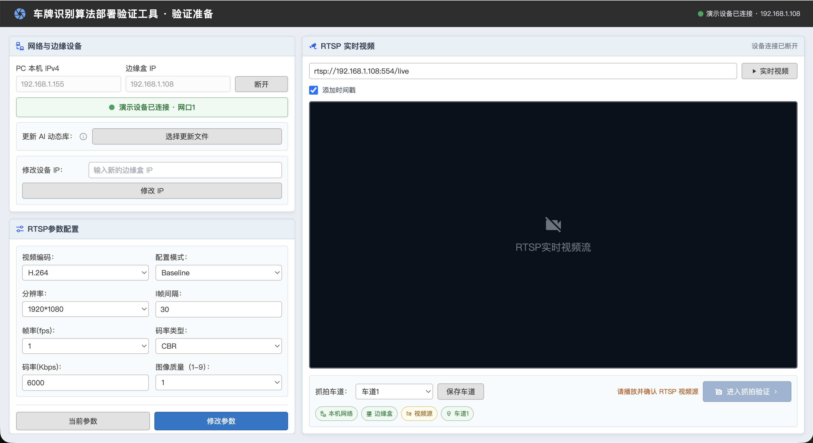
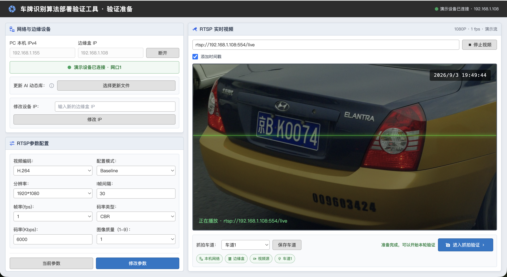
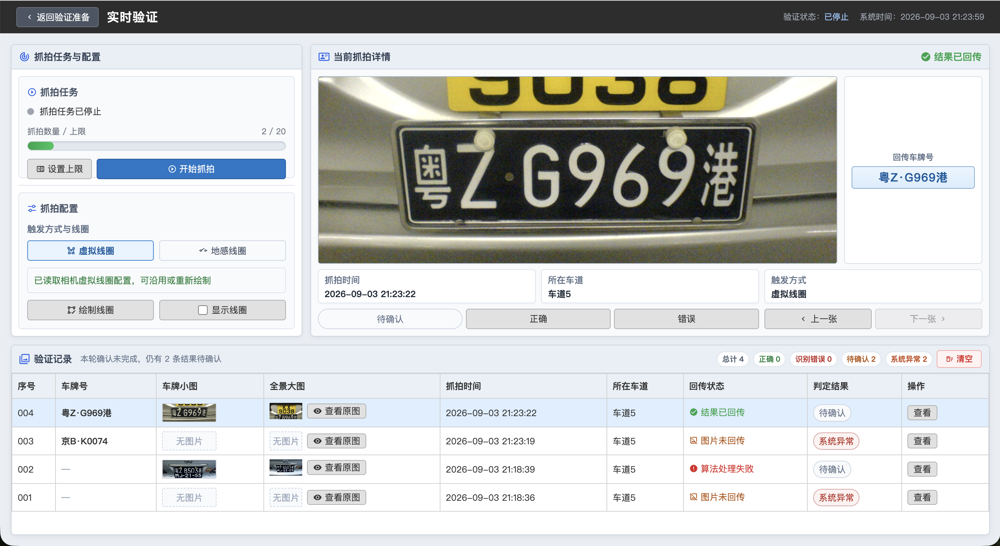
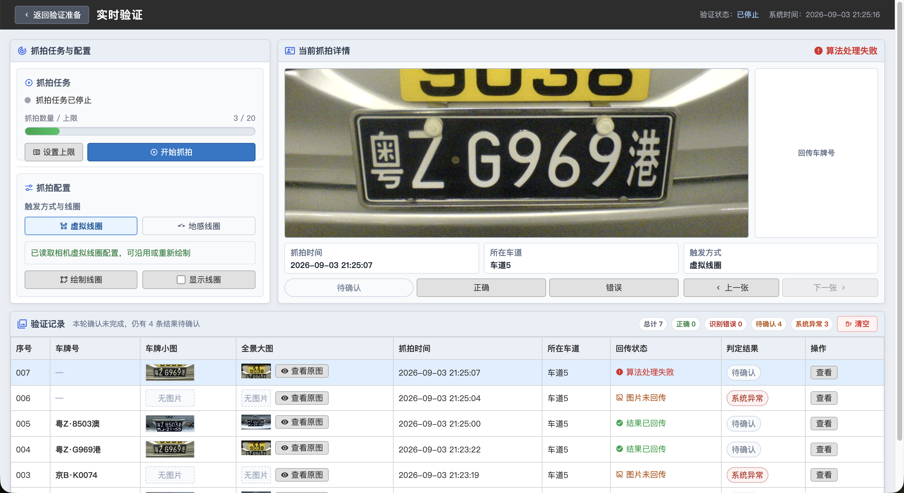
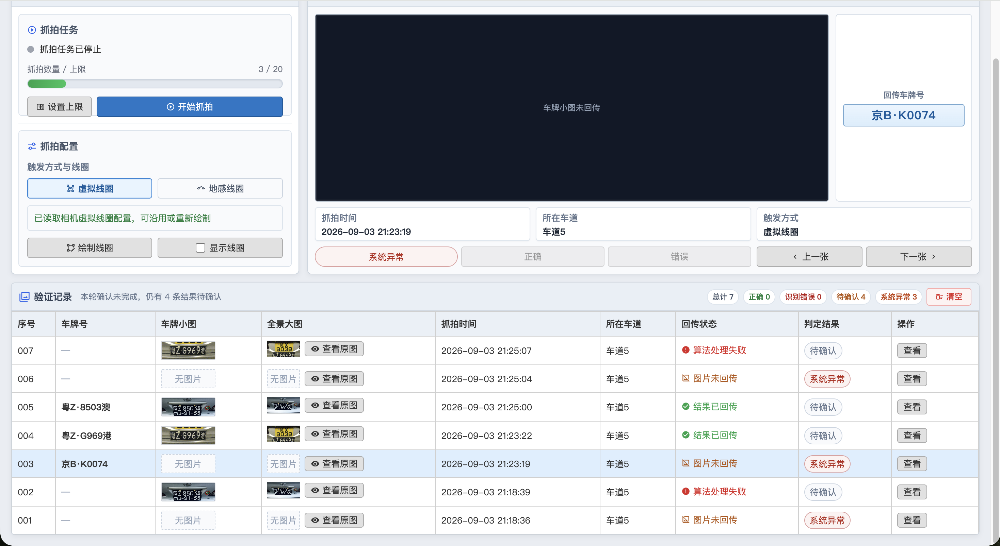
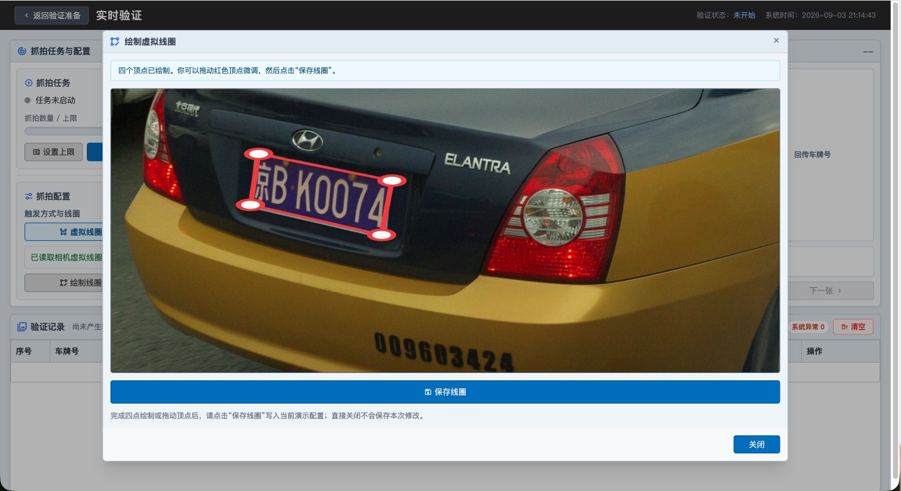

# 车牌识别算法部署验证工具｜原型展示

[打开验证准备原型](https://five-shrimp5k.github.io/Portfolio_LPR/plate-capture-system_main.html) · [打开实时验证原型](https://five-shrimp5k.github.io/Portfolio_LPR/capture.html)

## 原型界面

### 验证准备

### 实时验证

完整截图请查看 [`原型界面`](原型界面/) 目录。
